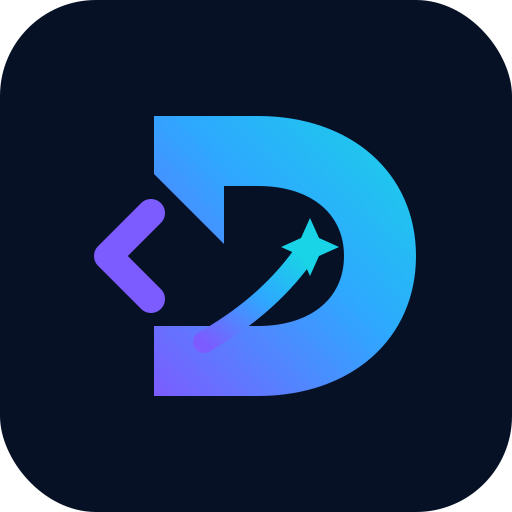

<div align="center">
  

# Hi, I'm Dana — a Python, C++ & Full-Stack Developer.

### I turn ideas into software—thoughtfully, patiently, and one honest commit at a time.

[](mailto:danadoago92@gmail.com)
[](https://github.com/danadoago92-coder)

</div>

---

## A little about me

I'm a developer working with **Python**, **C++**, and **full-stack web technologies**. I enjoy understanding how things work beneath the surface, solving practical problems, and turning an idea into a complete product—from the logic behind it to the experience people see.

I don't pretend to know everything. What matters to me is learning well, finishing what I start, and making each project better than the last. I like the moment when a confusing problem becomes clear, when an idea finally works, and when something I built becomes useful to another person.

```text
An idea starts quietly,
then courage gives it form;
I build through every question,
and learn through every storm.
```

## What I'm doing now

🐍 Building practical tools and backends with Python  
⚙️ Strengthening problem-solving and core programming with C++  
🌐 Creating complete web experiences across frontend and backend  
🛠️ Practicing clean code, documentation, and real Git workflows  
🤝 Open to helpful feedback, collaboration, and junior opportunities

## Languages & development

<p>
  
  
  
</p>

My focus is not only on collecting technologies. I want to understand the full path from a problem to a reliable solution: planning, coding, testing, documenting, and improving the result.

## The way I work

- **Curious:** I ask why, not only how.
- **Persistent:** Getting stuck is part of the process—not the end of it.
- **Thoughtful:** Clear work and clear communication both matter.
- **Honest:** I show real progress instead of decorating the page with skills I cannot prove yet.

## Work worth opening

This space is intentionally waiting for real projects. Each featured repository will include the problem, the decisions I made, how to run it, and what I learned.

<!-- When projects are ready, replace this comment with:
### Project name
One clear sentence: what it does and who it helps.
`technology` · `technology` · [Repository](URL) · [Live demo](URL)
-->

## Let's talk

If you have a learning opportunity, a junior role, a small project, or simply useful advice, I would be happy to hear from you.

📬 **Email:** [danadoago92@gmail.com](mailto:danadoago92@gmail.com)  
🐙 **GitHub:** [danadoago92-coder](https://github.com/danadoago92-coder)

---

<div align="center">

_Still learning. Still building. Becoming better with every commit._

</div>
